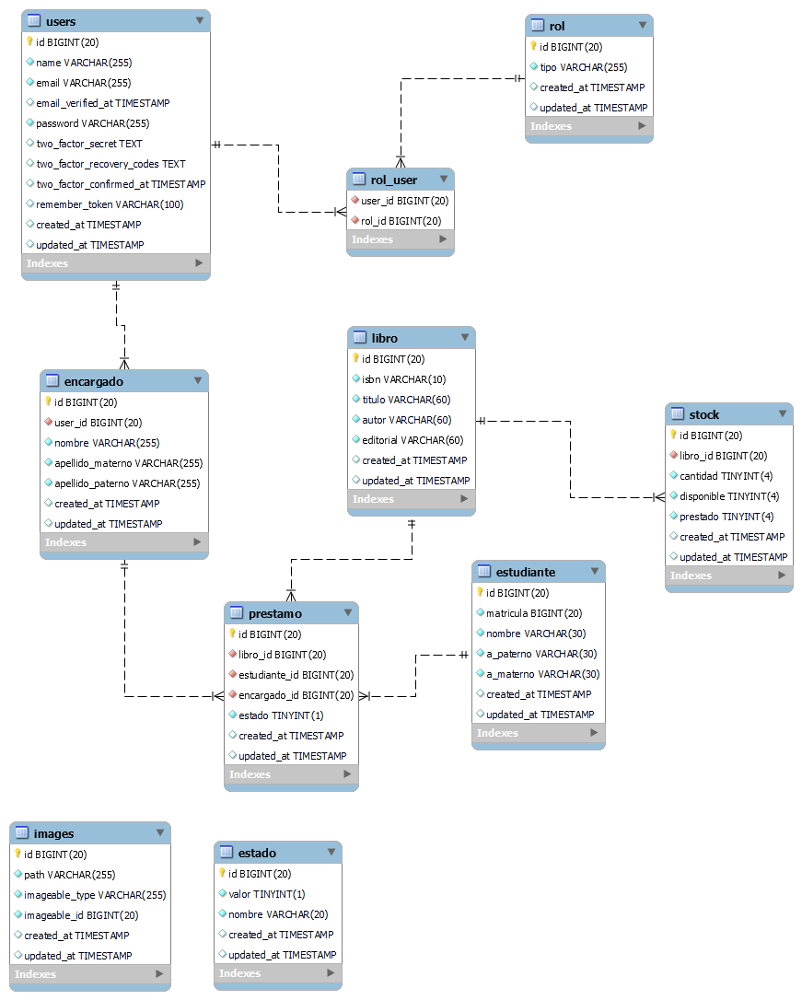
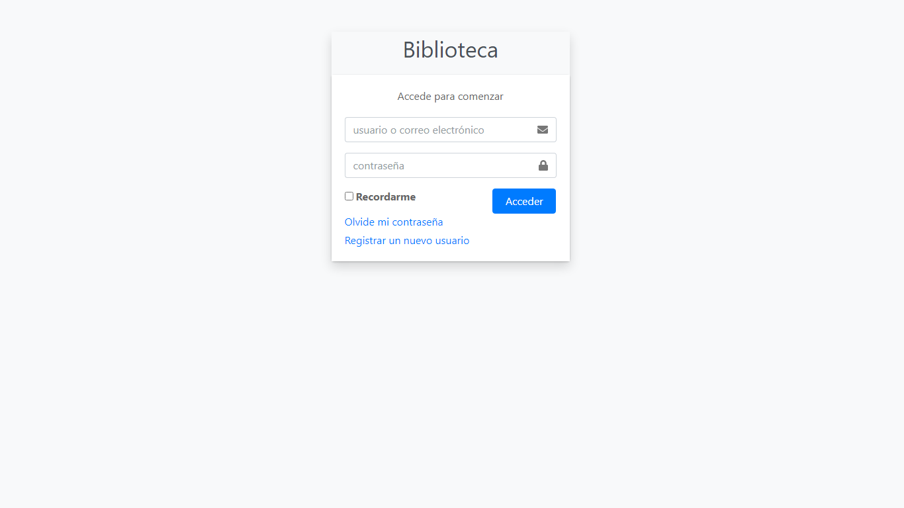
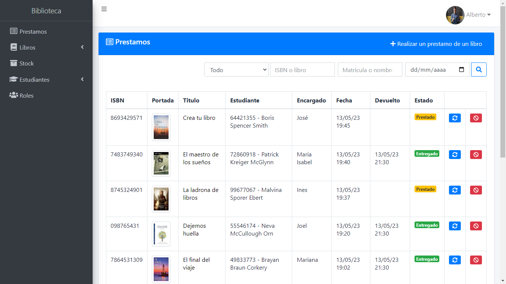
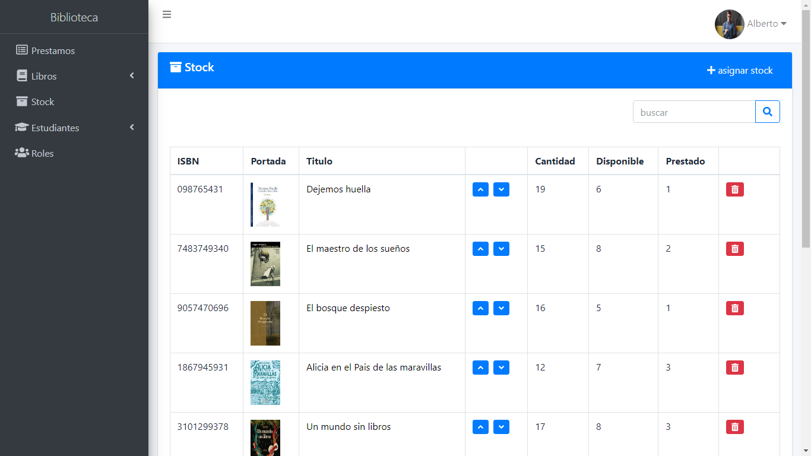
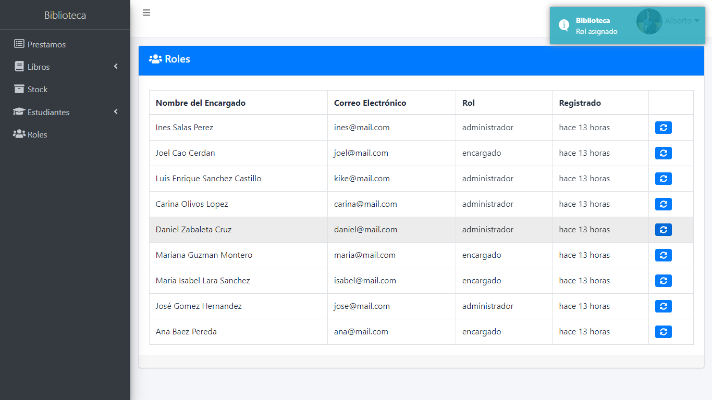

# Descripción General - Biblioteca
Es un sistema de una biblioteca donde existen dos tipos de roles, el administrador y el encargado. Cada rol tiene ciertos privilegios para realizar acciones. Se registran los estudiantes y los libros, y cada libro tiene un stock de la cantidad y existencia de los mismos. Así como, se pueden subir portadas (imágenes) de los libros. También se pueden registrar nuevos usuarios, editar su perfil y subir una foto de perfil. También lleva el control de los libros que se ha prestado y se han devuelto. Hace uso del paquete de Laravel Fortify para la autenticación y se utiliza Vue 3 para la implementación del sistema 

# Requerimientos
* PHP 8.1
* Laravel 10
* Microsoft SQL Server 2019 Express
* Última versión:
    * Composer
    * Node.js
    * npm

Notas: 
* Si usas un SGBD diferente, debes mirar la documentación oficial de Laravel y ajustar los nuevos parámetros de las credenciales en el archivo .env
[Leer más](https://laravel.com/docs/10.x/database "Ir a  documentación")

* Si quieres configurar SQL Server para este proyecto tu debes seguir los pasos en el siguiente enlace. [Leer más](https://learn.microsoft.com/es-es/sql/connect/php/microsoft-php-driver-for-sql-server?view=sql-server-ver16 "Leer más") 

* Si quieres configurar la autenticación por inicio de sesión para SQL Server tu debes seguir el siguiente enlace. [Leer más](https://learn.microsoft.com/en-us/sql/relational-databases/security/authentication-access/create-a-login?view=sql-server-ver16 "Leer más")

# Primeros pasos

### **Descarga o clona este repositorio**
```bash
git clone https://github.com/olmos-dev/biblioteca.git
```

### **Instalar**
Instala la carpeta *vendor* para el proyecto
```bash
composer update
```

Instala *node modules*
```bash
npm install
```

### **Cofigurar la Base de Datos**

1. crea una nueva base de datos llamada biblioteca

2. crea un nuevo archivo .env en la raíz del proyecto

3. Ahora ajusta los parámetros de las base de datos que utilizas en el archivo .env

    ```bash
    DB_CONNECTION=sqlsrv
    DB_HOST=127.0.0.1
    DB_PORT=1433
    DB_DATABASE=laravel
    DB_USERNAME=developer
    DB_PASSWORD=12345678
    ```
4. También ajusta la configuración y las credenciales de **mailtrap** (debes de crear una cuenta o usar algún otro servicio) en el archivo .env

    ```bash
    MAIL_MAILER=smtp
    MAIL_HOST=sandbox.smtp.mailtrap.io
    MAIL_PORT=2525
    MAIL_USERNAME="tu_username"
    MAIL_PASSWORD="tu_contraseña"
    MAIL_ENCRYPTION=tls
    MAIL_FROM_ADDRESS="biblioteca@example.com"
    MAIL_FROM_NAME="${APP_NAME}"
    ```

5. Debes correr las migraciones para crear la tablas en la base de datos 
    ```bash
    php artisan migrate
    ```
6. Debes correr los *seeders* para poblar la base de datos 
    ```bash
    php artisan db:seed
    ```
        
### **Genera una llave**

Debes generar una nueva llave para la aplicación

```bash
php artisan key:generate
```

# Correr el proyecto
Ejecuta el servidor de laravel
```bash
php artisan serve
```
Ejecuta el servidor de npm 
```bash
npm run dev
```
Ahora abre el proyecto y disfruta de la aplicación
```bash
http://127.0.0.1:8000/biblioteca
```

Note: hay tres perfiles para iniciar sesión disponibles o también puedes registar un nuevo usuario

|Nombre de usuari|Correo|Contraseña|
|:-----|----|-------:|
|alberto94|alberto@mail.com|123
|ana85|ana@mail.com|123
|jose93|jose@mail.com|123

# Demostración en vivo
Pulsa aquí [biblioteca](https://agendacontactos2.000webhostapp.com/ "Ir al demo")

# Tecnologías y herramientas usadas
* Laravel 10
* Vue 3
* PHP 8.1
* Bootstrap 4.6
* SQL Server Express Edition 
* Javascript
* AdminLTE 3

# Documentación

## Diagrama entidad relación



## Relaciones

* La tabla **users** tiene una relacion *muchos a muchos* con la tabla **rol**

* La tabla **users** tiene una relacion *uno a uno*
con la tabla **encargado**

* La tabla **prestamo** tiene una relación *uno a muchos* con la tablas **encargado**, **libro** y **estudiante**

* La tabla **libro** tiene una relación *uno a uno* con la tabla **stock**

* La tabla **images** tiene una relación *polimorfica uno a uno* con las tablas **libro** y **users**; es decir se pueden subir images a cada tabla respectivamente

* La tabla **estado** contiene dos valores boolenos: entregado y prestado. Se refiere al estado del prestamo del libro.

## Fortify
Se utilizó el paquete de autenticación **Laravel Fortify**

* Se puede inicar sesión con correo electrónico o nombre de usuario
* Se puede registar un nuevo usuario
* Envío al correo electrónico el enlace para restablecer las contraseñas
* Formulario para restablecer contraseñas
* Verificación de correo electrónico para acceder a la aplicación
* Cerrar sesión

## Roles
Se implemento un middleware para la proteción de las rutas de acceso en caso que sea un administrador o no.
* Existen dos tipos de roles el administrador y el encargado
* El administrador puede decrementar e incremetar el stock de los libros
* El administrador solmante puede asignar roles
* El administrador puede realizar la acción de eliminar

## Screenshots







